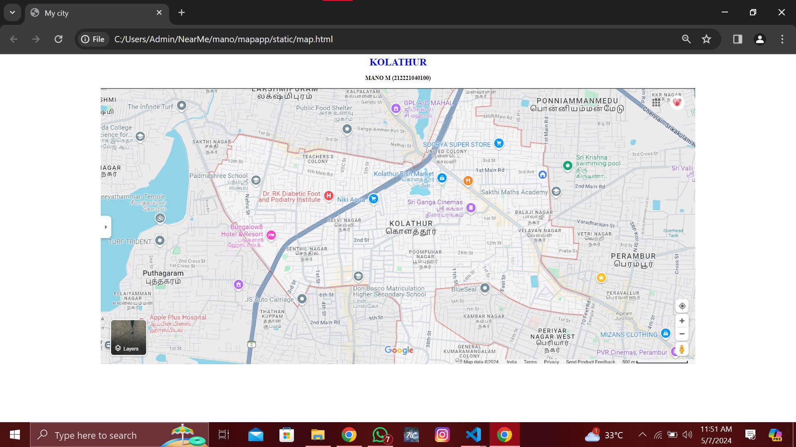
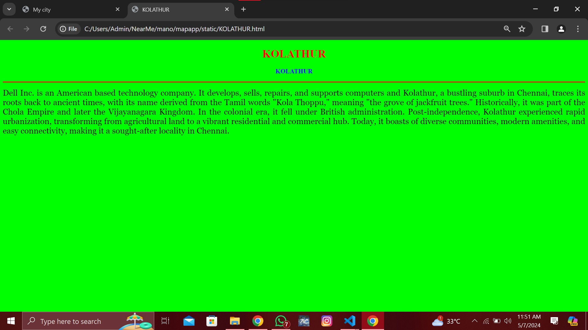
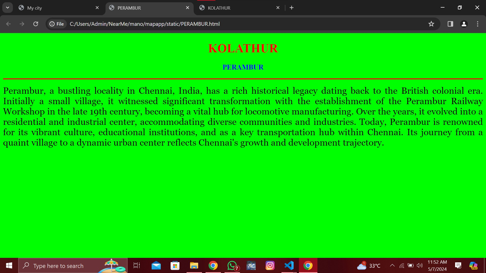
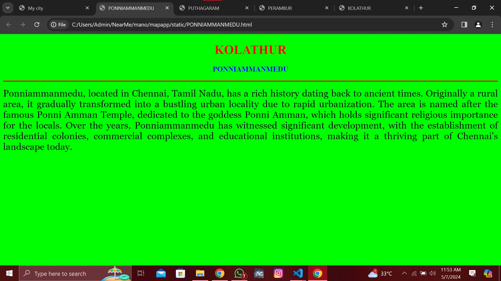
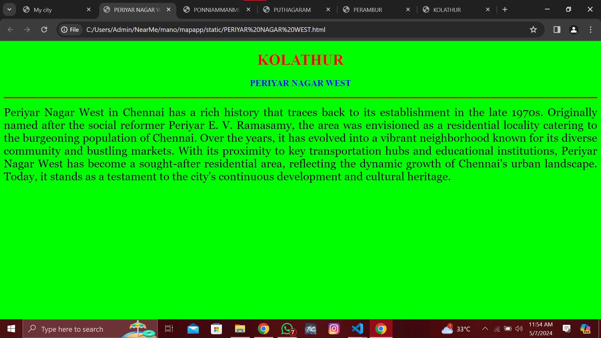

# Ex04 Places Around Me
## Date: 07/05/2024

## AIM
To develop a website to display details about the places around my house.

## DESIGN STEPS

### STEP 1
Create a Django admin interface.

### STEP 2
Download your city map from Google.

### STEP 3
Using ```<map>``` tag name the map.

### STEP 4
Create clickable regions in the image using ```<area>``` tag.

### STEP 5
Write HTML programs for all the regions identified.

### STEP 6
Execute the programs and publish them.

## CODE
MAP.HTML
```
<html>
<head>
<title>My city</title>
</head>
<body>
<h1 align="center">
<font color="blue"><b>KOLATHUR</b></font>
</h1>
<h3 align="center">
<font color="black"><b>MANO M (212221040100)</b></font>
</h3>
<centre>
<h4 align="center">
<map name="MyCity">
   <!-- Image Map Generated by http://www.image-map.net/ -->


<map name="image-map">
    <area target="_blank" alt="KOLATHUR" title="KOLATHUR" href="KOLATHUR.html" coords="885,407,1110,491" shape="rect">
    <area target="_blank" alt="PERAMBUR" title="PERAMBUR" href="PERAMBUR.html" coords="1621,510,1792,583" shape="rect">
    <area target="_blank" alt="PUTHAGARAM" title="PUTHAGARAM" href="PUTHAGARAM.html" coords="120,559,266,633" shape="rect">
    <area target="_blank" alt="PONNIAMMANMEDU" title="PONNIAMMANMEDU" href="PONNIAMMANMEDU.html" coords="1380,12,1694,88" shape="rect">
    <area target="_blank" alt="PERIYAR NAGAR WEST" title="PERIYAR NAGAR WEST" href="PERIYAR NAGAR WEST.html" coords="1370,758,1535,846" shape="rect">
</map>
</h4>
</map>
</centre>
</body>
</html>
```
KOLATHUR.HTML
```
<!DOCTYPE html>
<html lang="en">

<head>
    <title>KOLATHUR</title>
</head>

<body bgcolor="lime">
    <h1 align="center">
        <font color="red"><b>KOLATHUR</b></font>
    </h1>
    <h3 align="center">
        <font color="blue"><b>KOLATHUR</b></font>
    </h3>
    <hr size="3" color="red">
    <p align="justify">
        <font face="Georgia" size="5">
            Dell Inc. is an American based technology company. It develops, sells, repairs, and supports computers and
            Kolathur, a bustling suburb in Chennai, traces its roots back to ancient times, with its name derived from the Tamil words "Kola Thoppu," meaning "the grove of jackfruit trees." Historically, it was part of the Chola Empire and later the Vijayanagara Kingdom. In the colonial era, it fell under British administration. Post-independence, Kolathur experienced rapid urbanization, transforming from agricultural land to a vibrant residential and commercial hub. Today, it boasts of diverse communities, modern amenities, and easy connectivity, making it a sought-after locality in Chennai.
        </font>
    </p>
</body>

</html>
```
PERAMBUR.HTML
```
<!DOCTYPE html>
<html lang="en">

<head>
    <title>PERAMBUR</title>
</head>

<body bgcolor="lime">
    <h1 align="center">
        <font color="red"><b>KOLATHUR</b></font>
    </h1>
    <h3 align="center">
        <font color="blue"><b>PERAMBUR</b></font>
    </h3>
    <hr size="3" color="red">
    <p align="justify">
        <font face="Georgia" size="5">
            Perambur, a bustling locality in Chennai, India, has a rich historical legacy dating back to the British colonial era. Initially a small village, it witnessed significant transformation with the establishment of the Perambur Railway Workshop in the late 19th century, becoming a vital hub for locomotive manufacturing. Over the years, it evolved into a residential and industrial center, accommodating diverse communities and industries. Today, Perambur is renowned for its vibrant culture, educational institutions, and as a key transportation hub within Chennai. Its journey from a quaint village to a dynamic urban center reflects Chennai's growth and development trajectory.
        </font>
    </p>
</body>

</html>
```
PUTHAGARAM.HTML
```
<!DOCTYPE html>
<html lang="en">

<head>
    <title>PUTHAGARAM</title>
</head>

<body bgcolor="lime">
    <h1 align="center">
        <font color="red"><b>KOLATHUR</b></font>
    </h1>
    <h3 align="center">
        <font color="blue"><b>PUTHAGARAM</b></font>
    </h3>
    <hr size="3" color="red">
    <p align="justify">
        <font face="Georgia" size="5">
            Puthagaram, a bustling neighborhood in Chennai, has a rich history dating back to ancient times. Originally known for its agrarian roots, it gradually transformed into a thriving urban locality. Its name translates to "village of books," reflecting its historical significance as a hub for literature and learning. Over the years, Puthagaram has witnessed waves of cultural influences, contributing to its vibrant atmosphere. Today, it stands as a dynamic blend of tradition and modernity, with its streets bustling with commerce and culture.
        </font>
    </p>
</body>

</html>
```
PONNIAMMANMEDU.HTML
```
<!DOCTYPE html>
<html lang="en">

<head>
    <title>PONNIAMMANMEDU</title>
</head>

<body bgcolor="lime">
    <h1 align="center">
        <font color="red"><b>KOLATHUR</b></font>
    </h1>
    <h3 align="center">
        <font color="blue"><b>PONNIAMMANMEDU</b></font>
    </h3>
    <hr size="3" color="red">
    <p align="justify">
        <font face="Georgia" size="5">
            Ponniammanmedu, located in Chennai, Tamil Nadu, has a rich history dating back to ancient times. Originally a rural area, it gradually transformed into a bustling urban locality due to rapid urbanization. The area is named after the famous Ponni Amman Temple, dedicated to the goddess Ponni Amman, which holds significant religious importance for the locals. Over the years, Ponniammanmedu has witnessed significant development, with the establishment of residential colonies, commercial complexes, and educational institutions, making it a thriving part of Chennai's landscape today.
        </font>
    </p>
</body>

</html>
```
PERIYAR NAGAR WEST.HTML
```
<!DOCTYPE html>
<html lang="en">

<head>
    <title>PERIYAR NAGAR WEST</title>
</head>

<body bgcolor="lime">
    <h1 align="center">
        <font color="red"><b>KOLATHUR</b></font>
    </h1>
    <h3 align="center">
        <font color="blue"><b>PERIYAR NAGAR WEST</b></font>
    </h3>
    <hr size="3" color="red">
    <p align="justify">
        <font face="Georgia" size="5">
            Periyar Nagar West in Chennai has a rich history that traces back to its establishment in the late 1970s. Originally named after the social reformer Periyar E. V. Ramasamy, the area was envisioned as a residential locality catering to the burgeoning population of Chennai. Over the years, it has evolved into a vibrant neighborhood known for its diverse community and bustling markets. With its proximity to key transportation hubs and educational institutions, Periyar Nagar West has become a sought-after residential area, reflecting the dynamic growth of Chennai's urban landscape. Today, it stands as a testament to the city's continuous development and cultural heritage.
        </font>
    </p>
</body>

</html>
```
## OUTPUT







## RESULT
The program for implementing image maps using HTML is executed successfully.
